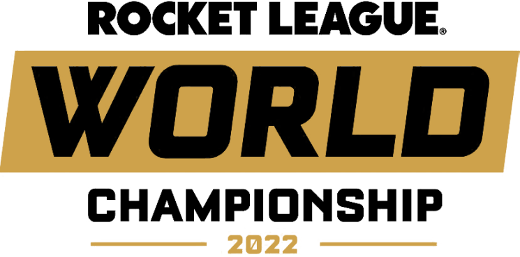

# Rocket League Playoff Bot for Discord 🚀🏆

This project is a Discord bot designed to scrape and display Rocket League World Championships 2023 playoff brackets from Liquipedia. The bot uses [Discord.js](https://discord.js.org/#/) and is written in TypeScript. Future iterations of this bot aim to include subscriptions to various Rocket League competitions and real-time game win notifications.

<div align="center">
    
</div>

## Table of Contents

- [Features](#features)
- [Prerequisites](#prerequisites)
- [Installation](#installation)
- [Usage](#usage)
- [Future Development](#future-development)
- [Contributing](#contributing)
- [License](#license)
- [Acknowledgements](#acknowledgements)

## Features

- Scrape playoff bracket information in real-time.
- Display scraped information in a Discord channel through a well-formatted embed.
- Search for and display specific matchups.

## Prerequisites

- [Node.js](https://nodejs.org/en/)
- [TypeScript](https://www.typescriptlang.org/)
- [Discord.js](https://discord.js.org/#/)
- A Discord account and a server for testing

## Installation

1. Clone the repository:
    ```bash
    git clone https://github.com/gdamou/rocket-league-esport-bot.git
    ```

2. Navigate to the project directory:
    ```bash
    cd rocket-league-esport-bot
    ```

3. Install dependencies:
    ```bash
    pnpm install
    ```

4. Create a `.env` file and add your Discord bot token and other configuration variables:
    ```ini
    BOT_TOKEN=your-bot-token
    CHANNEL_ID=your-channel-id
    SCRAPE_URL=your-scrape-url
    ```

5. Compile TypeScript code:
    ```bash
    pnpm build
    ```

6. Run the bot:
    ```bash
    pnpm start
    ```

## Usage

- To fetch and display the latest playoff matchups, use the following command on your discord channel :
    ```
    !bracket
    ```

## Future Development

- Add a subscription feature for real-time game win notifications.
- Use the Liquipedia API for more reliable data retrieval.
- Implement more Rocket League competitions other than just the 2023 World Championships PlayOff.

## Contributing

Feel free to fork the repository and submit pull requests. For major changes, please open an issue first to discuss what you'd like to change.

## License

This project is open source and available under the [MIT License](LICENSE).

## Acknowledgements

- Rocket League and its community
- Liquipedia for providing up-to-date information
- Discord.js library